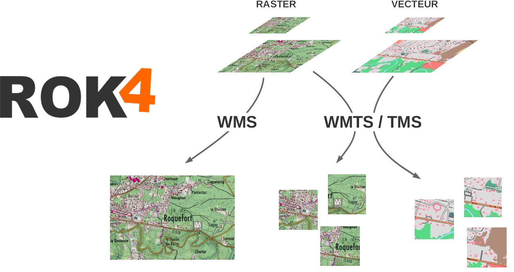
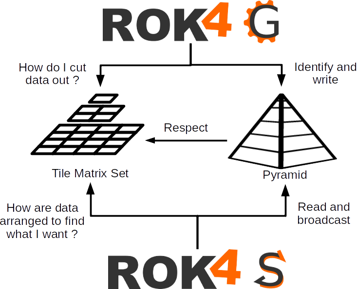
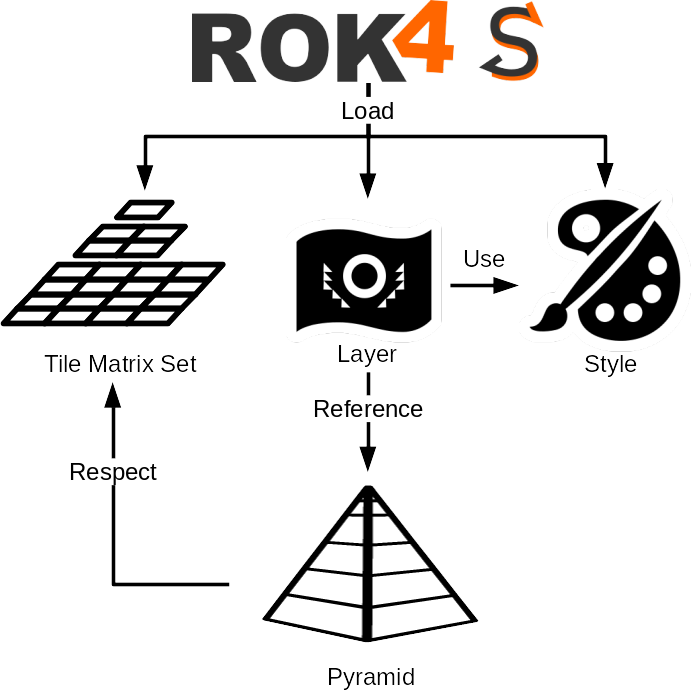

ROK4 est un projet open-source (sous licence CeCILL-C) développé par les équipes du projet Géoportail de l’Institut National de l’Information Géographique et Forestière. Il contient un serveur (ROK4SERVER), écrit en C++, permettant la diffusion de données raster ou vecteur, et une suite d'outils (ROK4GENERATION) permettant de préparer les données utilisées par le serveur.

Le serveur implémente les standards ouverts de l’Open Geospatial Consortium (OGC) WMS 1.3.0 et WMTS 1.0.0, ainsi que le TMS (Tile Map Service). Il est utilisé pour l’intégralité de la diffusion des flux images et vecteur tuilé de la dernière version du Géoportail. Répondant aux besoins de diffusion image de l’IGN, ROK4SERVER vise deux objectifs principaux :
* L’utilisation d’un cache de données raster unique permettant de servir indifféremment des flux WMS, WMTS et TMS
* Des performances de traitement d’image et de diffusion accrues
* La diffusion de tuiles vecteur telles qu'elles sont stockées, sans transformation (TMS uniquement)
* La présentation en WMTS d'une pyramide non calculée, à partir d'autres pyramides ou de services WMS.



ROK4GENERATION est un ensemble de scripts de traitement permettant la préparation et la transformation de données géo-référencées vers le format de pyramide raster (potentiellement à la demande) et vecteur utilisé par ROK4.

* http://www.ign.fr [@IGNFrance](https://twitter.com/IGNFrance)
* http://www.geoportail.gouv.fr [@Geoportail](https://twitter.com/Geoportail)

ROK4 Version : 3.10.0-DEVELOP

- [Fonctionnement général](#fonctionnement-général)
- [Variables d'environnement](#variables-denvironnement)
	- [Pour le stockage](#pour-le-stockage)
	- [Pour l'utilisation de CURL](#pour-lutilisation-de-curl)
- [Compiler et installer le projet ROK4](#compiler-et-installer-le-projet-rok4)
	- [L'environnement de compilation](#lenvironnement-de-compilation)
	- [Les commandes externes](#les-commandes-externes)
	- [La documentation](#la-documentation)
	- [La compilation et l'installation](#la-compilation-et-linstallation)
		- [Instructions](#instructions)
		- [Options de compilation](#options-de-compilation)
			- [Gestion du stockage objet](#gestion-du-stockage-objet)
			- [Utilisation de Kakadu](#utilisation-de-kakadu)
			- [Expérimental](#expérimental)
		- [Exemple](#exemple)
		- [Docker](#docker)

# Fonctionnement général

Les données dans la pyramide sont tuilées selon un quadrillage défini dans le TileMatrixSet (plusieurs sont fournis dans le projet).



La pyramide produite par les outils ROK4GENERATION est décrite à travers un fichier, le descripteur de pyramide, qui va préciser le TMS utilisé pour découper les données, les caractéristiques des données images ou vecteur, les sources pour une pyramide à la demande, les différents niveaux de résolutions.

Pour que cette pyramide soit diffusée par ROK4SERVER, on va créer un descripteur de couche, qui va contenir à la fois des informations propres au serveur (nom, titre et résumé de la couche, styles...) mais aussi référencer le descripteur de la pyramide à diffuser.



* Pour avoir des précisions sur la partie [ROK4GENERATION](rok4generation/README.md)
* Pour avoir des précisions sur la partie [ROK4SERVER](rok4server/README.md), son déploiement et son utilisation
* Pour avoir les spécifications d'une [PYRAMIDE](docs/Specification_pyramide_ROK4.md)

# Variables d'environnement

Au fonctionnement du serveur et des outils de génération, plusieurs variables d'environnement sont exploitées.

## Pour le stockage

Afin d'utiliser des stockages objets (CEPH, S3 ou SWIFT), le serveur et les outils vont accéder aux différents clusters grâce aux informations stockées dans les variables d'environnement.

* CEPH
    - `ROK4_CEPH_CONFFILE`
    - `ROK4_CEPH_USERNAME`
    - `ROK4_CEPH_CLUSTERNAME`
* S3
    - `ROK4_S3_URL`
    - `ROK4_S3_KEY`
    - `ROK4_S3_SECRETKEY`
* SWIFT
    - `ROK4_SWIFT_AUTHURL`
    - `ROK4_SWIFT_USER`
    - `ROK4_SWIFT_PASSWD`
    - `ROK4_SWIFT_PUBLICURL`
    - Si authentification via Swift
        - `ROK4_SWIFT_ACCOUNT`
    - Si connection via keystone (présence de `ROK4_KEYSTONE_DOMAINID`)
        - `ROK4_KEYSTONE_DOMAINID`
        - `ROK4_KEYSTONE_PROJECTID`

Dans le cas du stockage SWIFT ou S3, la variable `ROK4_SSL_NO_VERIFY` est testée, et la vérification des certificats est désactivée si elle est présente.

Dans le cas d'un stockage Swift, la variable d'environnement `ROK4_SWIFT_TOKEN_FILE` est testée. Si elle contient le chemin vers un fichier qui existe, on ne fait pas la demande de jeton d'authentification à la connexion et on mettra en en-tête des requêtes le contenu de ce fichier. Lors de la déconnexion du contexte Swift, on exportera le jeton dans ce fichier si celui-ci a changé.

## Pour l'utilisation de CURL

CURL est utilisé à la fois via l'utilitaire en ligne de commande (dans les scripts Shell de génération) et via la librairie dans les parties en C++ (génération ou serveur). Vont être prise en compte les variables d'environnement HTTP_PROXY, HTTPS_PROXY et NO_PROXY


# Compiler et installer le projet ROK4

La compilation du projet n’a pour le moment été validée que sous GNU/Linux (Debian 9 et 10 et Centos 7). Le projet utilise des pthreads (threads POSIX).

## L'environnement de compilation

Afin de connaître les paquets et librairies à installer, référez vous aux Dockerfiles :

* Compilation du serveur ROK4 :
	* [Debian 9](./docker/rok4server/stretch.Dockerfile)
	* [Debian 10](./docker/rok4server/buster.Dockerfile)
	* [Centos 7](./docker/rok4server/centos7.Dockerfile)

* Compilation des outils de génération ROK4 :
	* [Debian 10](./docker/rok4generation/buster.Dockerfile)

## Les commandes externes

Les outils suivant sont nécessaires aux outils de génération :
* wget (be4)
* ogr2ogr (4alamo)
* tippecanoe (4alamo) : https://github.com/mapbox/tippecanoe.git

## La documentation

Pour la documentation du code source C++ : `sudo apt install doxygen graphviz`

Pour la documentation du code source Perl : `sudo apt install naturaldocs`

## La compilation et l'installation

### Instructions

```
mkdir build
cd build
cmake .. [-DOPTION1 -DOPTION2]
make
[make doc]
[make test]
make [install|package]`
```

### Options de compilation

`CMAKE_INSTALL_PREFIX (PATH)` : Dossier d'installation de ROK4. Valeur par défaut : `/usr/local`

`DEP_PATH (PATH)` : Path to compiled and installed ROK4 dependencies. Valeur par défaut : `./target`

`BUILD_DEPENDENCIES (BOOL)` : Compilation des dépendances manquantes de ROK4. Elles sont installées avec ROK4. Valeur par défaut : `TRUE`

`BUILD_ROK4 (BOOL)` : Compilation de la partie ROK4SERVER. Valeur par défaut : `TRUE`

`BUILD_BE4 (BOOL)` : Compilation de la partie ROK4GENERATION Valeur par défaut : `TRUE`

`BUILD_DOC (BOOL)` : Compilation de la documentation automatique (Doxygen et Naturaldocs). Crée la cible de compilation `make doc` à faire avant `make install`. Valeur par défaut : `TRUE`

`UNITTEST (BOOL)` : Compilation des tests unitaires. Crée la cible de compilation `make test`. Valeur par défaut : `FALSE`

`DEBUG_BUILD (BOOL)` : Compilation en mode debug. Valeur par défaut : `FALSE`


#### Gestion du stockage objet

`BUILD_OBJECT (BOOL)` : Il est possible de stocker les pyramides d'images dans des systèmes de stockage objet. Sont gérés CEPH, S3 et SWIFT. Cela implique d'avoir préalablement installé la librairie librados. Ne pas mettre TRUE mais `1` pour que ce soit bien interprété lors de la compilation dans le code. Valeur par défaut : `0`

#### Utilisation de Kakadu

Kakadu est une librairie propriétaire de manipulation d'images JPEG2000. Par défaut c'est OpenJpeg, libre, qui est utilisé.

`KDU_USE (BOOL)` : Active l'utilisation de Kakadu pour la lecture du JPEG2000. Ne pas mettre TRUE mais `1` pour que ce soit bien interprété lors de la compilation dans le code. Valeur par défaut : `0`

`KDU_LIBRARY_PATH (STRING)` : Si kakadu est utilisé, il est possible de fournir le chemin d'un dossier où chercher la librairie (les fichiers libkdu.a et libkdu_aux.a). Les headers sont embarqués dans le projet ROK4 . Valeur par défaut : `/usr/kakadu-6.4`

`KDU_THREADING (STRING)` : Nombre de threads utilisés par Kakadu. 0 => pas de thread, 1 => un seul thread, 2+ => multi-thread. Valeur par défaut : `0`

#### Expérimental

`RPM_PACKAGE (BOOL)` : Crée un paquet RPM au lieu d'un paquet tarball : `make package`. Valeur par défaut : `FALSE`

`DEB_PACKAGE (BOOL)` : Crée un paquet DEBIAN au lieu d'un paquet tarball : `make package`. Valeur par défaut : `FALSE`

`USE_SYSTEM_LIB (BOOL)` : Permet de forcer l'utilisation des librairies système plutôt que celles embarquées dans le projet. Concerne les librairies IMAGE, LZW, CPPUNIT, PKB, LOGGER et FCGI. Valeur par défaut : `FALSE`

### Exemple

```
mkdir build
cd build
cmake -DCMAKE_INSTALL_PREFIX=/opt/rok4 -DBUILD_DOC=TRUE -DUNITTEST=TRUE ..
make
make doc
make test
sudo make install
```

### Docker

Le projet propose les Dockerfile permettant la compilation et l'utilisation du serveur et des outils de génération au sein d'un conteneur. Des configurations pour docker-compose permettent de télécharger des jeux de données conteneurisés et de tester le serveur. Tous les détails sont [ici](docker/README.md).
