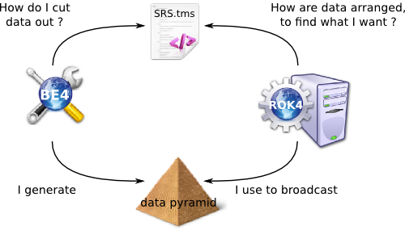
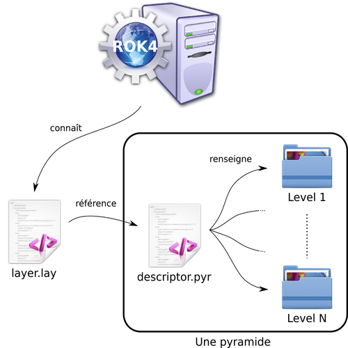

ROK4 est un projet open-source (sous licence CeCILL-C) développé par les équipes du projet Géoportail de l’Institut National de l’Information Géographique et Forestière. Il contient un serveur (ROK4SERVER), écrit en C++, permettant la diffusion de données images géo-référencées, et une suite d'outils (BE4) permettant de préparer les données utilisées par le serveur.

Le serveur implémente les standards ouverts de l’Open Geospatial Consortium (OGC) WMS 1.3.0 et WMTS 1.0.0. Il est utilisé pour l’intégralité de la diffusion des flux images de la dernière version du Géoportail. Répondant aux besoins de diffusion image de l’IGN, ROK4SERVER vise deux objectifs principaux :
* L’utilisation d’un cache de données raster unique permettant de servir indifféremment des flux WMS et WMTS
* Des performances de traitement d’image et de diffusion accrues

BE4 est un ensemble de scripts de traitement permettant la préparation et la transformation de données images géo-référencées vers le format de cache raster utilisé par ROK4.


* Compilation sur travis-ci : [](https://travis-ci.org/rok4/rok4)
* Rejoindre le chat Gitter : [](https://gitter.im/rok4/rok4?utm_source=badge&utm_medium=badge&utm_campaign=pr-badge&utm_content=badge)
* http://www.ign.fr [@IGNFrance](https://twitter.com/IGNFrance)
* http://www.geoportail.gouv.fr [@Geoportail](https://twitter.com/Geoportail)
* http://www.rok4.org

ROK4 Version : 2.2.1-DEVELOP

# Fonctionnement général

Les données dans la pyramide d'images sont tuilées selon un quadrillage défini dans le TileMatrixSet (plusieurs sont fournis dans le projet).



La pyramide produite par les outils BE4 est décrite à travers un fichier, le descripteur de pyramide, qui va préciser le TMS utilisé pour découper les données, les caractéristiques des images, les différents niveaux de résolutions.

Pour que cette pyramide soit diffusée par ROK4SERVER, on va créer un descripteur de couche, qui va contenir à la fois des informations propres au serveur (nom, titre et résumé de la couche, styles...) mais aussi référencer le descripteur de la pyramide à diffuser.



* Pour avoir des précisions sur la partie [BE4](be4/README.md)
* Pour avoir des précisions sur la partie [ROK4SERVER](rok4/README.md), son déploiement et son utilisation
* Pour avoir les spécifications d'une [PYRAMIDE](docs/Specification_pyramide_ROK4.md)

# Compiler et installer le projet ROK4

La compilation du projet n’a pour le moment été validée que sous GNU/Linux (Debian 8 et Centos 7). Le projet utilise des pthreads (threads POSIX).

## L'environnement de compilation

Pour la partie C++ :
* Debian : `sudo apt install build-essential cmake`
* Centos : `yum install make cmake gcc gcc-c++`

Pour la partie Perl :
* Debian : `sudo apt install perl perl-base`
* Centos : `yum install perl perl-CPAN`

## Les librairies

### C++

Pour centos, il est nécessaire d'ajouter un dépôt pour avoir accès aux paquets nécessaires : `yum install -y epel-release`

Les paquets (`Debian`|`Centos`) à installer sont :
* (`libfcgi-dev`|`fcgi-devel`) pour que le serveur ROK4 gère les requêtes
* (`gettext`|`gettext`) pour l'internationalisation des logs
* (`libtinyxml-dev`|`tinyxml-devel`) pour la lecture des configuration XML
* (`zlib1g-dev`|`zlib-devel`) pour la compression ZIP
* (`libtiff5-dev`|`libtiff-devel`) pour la lecture et écriture des images TIFF
* (`libpng16-dev`|`libpng-devel`) pour la lecture des images PNG
* (`libcurl4-openssl-dev`|`libcurl-devel`) et (`libssl-dev`|`openssl-devel`) pour l'envoi de requête HTTP(S)
* (`libturbojpeg0-dev`|`turbojpeg-devel`) et (`libjpeg`|`libjpeg-turbo-devel`) pour la lecture des images JPEG
* (`libopenjp2-7-dev`|`openjpeg2-devel`) pour la lecture des images JPEG2000 si Kakadu n'est pas utilisé
* (`libc6-dev`|) pour les l'utilisation de thread POSIX

Si la gestion du stockage objet est voulue :
* (`librados-dev`|`librados2-devel`) pour la lecture et l'écriture d'objets sur un cluster Ceph

### Perl

Les librairies Perl sont installable via l'outil CPAN : `cpan Lib::Perl` (en sudo pour une installation système). Certaines des librairies utilisées sont installées avec le paquet `perl-base`

* Data::Dumper
* DBD::Pg
* Digest::SHA
* ExtUtils::MakeMaker
* File::Find::Rule
* File::Map
* FindBin
* HTTP::Request
* HTTP::Request::Common
* HTTP::Response
* Log::Log4perl
* LWP::UserAgent
* Math::BigFloat
* Test::More
* Tie::File
* XML::LibXML

On installe les librairies Perl GDAL via le paquet :
* Debian : `apt install libgdal-perl`
* Centos : `yum install gdal-perl`

Soit :
```
cpan DBD::Pg Data::Dumper Digest::SHA ExtUtils::MakeMaker File::Find::Rule File::Map FindBin Geo::GDAL Geo::OGR Geo::OSR HTTP::Request HTTP::Request::Common HTTP::Response Log::Log4perl LWP::UserAgent Math::BigFloat Test::More Tie::File XML::LibXML
```

Si volonté d'utiliser l'outil graphique `tms-converter-gui.pl` :
* Tk
* Tk::EntryCheck
* Tk::FileSelect
* Tk::LabFrame
* Tk::NoteBook
* Tk::ROText
* Tk::Table

Soit :
```
cpan Tk Tk::EntryCheck Tk::FileSelect Tk::LabFrame Tk::NoteBook Tk::ROText Tk::Table
```

Pour savoir où sont cherchées les librairies, exécuter `env -i perl -V`.

Pour vérifier que toutes les librairies nécessaires sont installées, exécuter le script `perl be4/pyramide/verify-dependencies.pl`.

## La documentation

Pour la documentation du code source C++ : `sudo apt install doxygen graphviz`

Pour la documentation du code source Perl : `sudo apt install naturaldocs`

## La compilation et l'installation

### Instructions

```
mkdir build
cd build
cmake .. [-DOPTION1 -DOPTION2]
make
[make doc]
[make test]
make [install|package]`
```

### Options de compilation

`CMAKE_INSTALL_PREFIX (PATH)` : Dossier d'installation de ROK4. Valeur par défaut : `/usr/local`

`DEP_PATH (PATH)` : Path to compiled and installed ROK4 dependencies  Valeur par défaut : `./target`

`BUILD_DEPENDENCIES (BOOL)` : Compilation des dépendances manquantes de ROK4. Elles sont installées avec ROK4. Valeur par défaut : `TRUE`

`BUILD_ROK4 (BOOL)` : Compilation de la partie ROK4SERVER. Valeur par défaut : `TRUE`

`BUILD_BE4 (BOOL)` : Compilation de la partie BE4  Valeur par défaut : `TRUE`

`BUILD_DOC (BOOL)` : Compilation de la documentation automatique (Doxygen et Naturaldocs). Crée la cible de compilation `make doc` à faire avant `make install`. Valeur par défaut : `TRUE`

`UNITTEST (BOOL)` : Compilation des tests unitaires. Crée la cible de compilation `make test`. Valeur par défaut : `FALSE`

`DEBUG_BUILD (BOOL)` : Compilation en mode debug. Valeur par défaut : `FALSE`


#### Gestion du stockage objet

`BUILD_OBJECT (BOOL)` : Il est possible de stocker les pyramides d'images dans des systèmes de stockage objet. Sont gérés CEPH, S3 et SWIFT. Cela implique d'avoir préalablement installé la librairie librados. Ne pas mettre TRUE mais `1` pour que ce soit bien interprété lors de la compilation dans le code. Valeur par défaut : `0`   

#### Utilisation de Kakadu

Kakadu est une librairie propriétaire de manipulation d'images JPEG2000. Par défaut c'est OpenJpeg, libre, qui est utilisé.

`KDU_USE (BOOL)` : Active l'utilisation de Kakadu pour la lecture du JPEG2000. Valeur par défaut : `FALSE`

`KDU_LIBRARY_PATH (STRING)` : Si kakadu est utilisé, il est possible de fournir le chemin d'un dossier où chercher la librairie (les fichiers libkdu.a et libkdu_aux.a). Les headers sont embarqués dans le projet ROK4 . Valeur par défaut : `/usr/kakadu-6.4`

`KDU_THREADING (STRING)` : Nombre de threads utilisés par Kakadu. 0 => pas de thread, 1 => un seul thread, 2+ => multi-thread. Valeur par défaut : `0`

#### Expérimental

`RPM_PACKAGE (BOOL)` : Crée un paquet RPM au lieu d'un paquet tarball : `make package`. Valeur par défaut : `FALSE`

`DEB_PACKAGE (BOOL)` : Crée un paquet DEBIAN au lieu d'un paquet tarball : `make package`. Valeur par défaut : `FALSE`

`USE_SYSTEM_LIB (BOOL)` : Permet de forcer l'utilisation des librairies système plutôt que celles embarquées dans le projet. Concerne les librairies IMAGE, LZW, CPPUNIT, PKB, LOGGER et FCGI. Valeur par défaut : `FALSE`

### Exemple

```
mkdir build
cd build
cmake -DCMAKE_INSTALL_PREFIX=/opt/rok4 -DBUILD_DOC=TRUE -DUNITTEST=TRUE ..
make
make doc
make test
sudo make install
```
