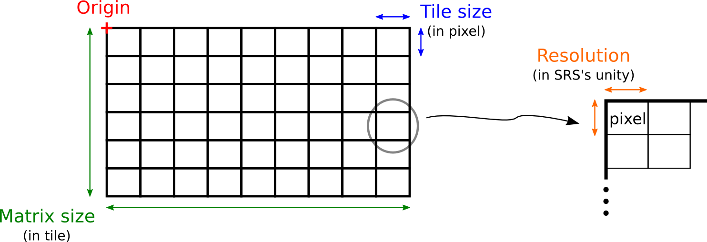
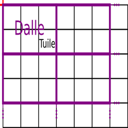
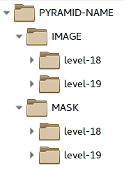
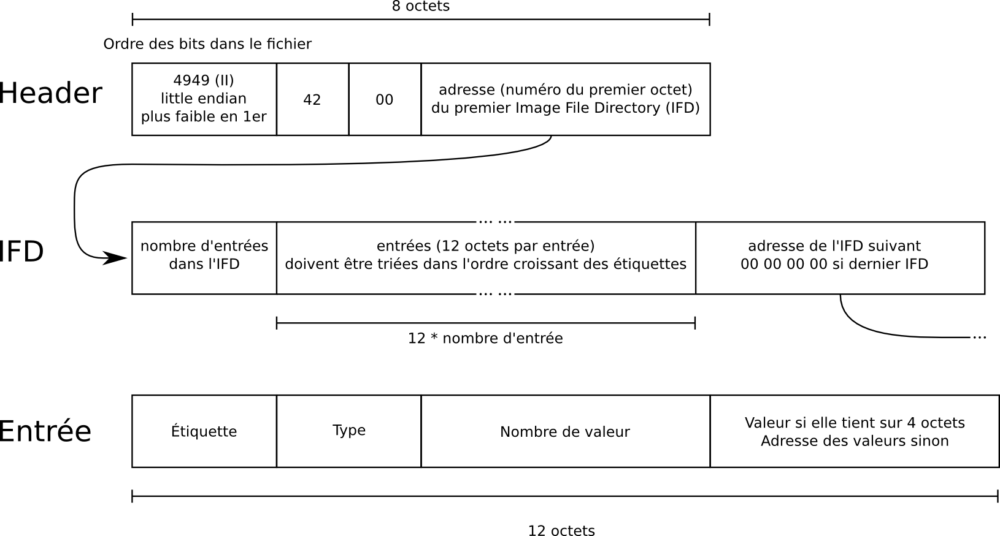
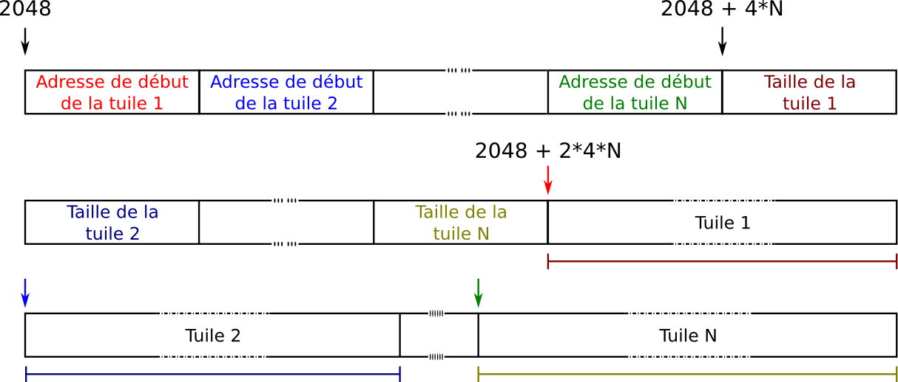
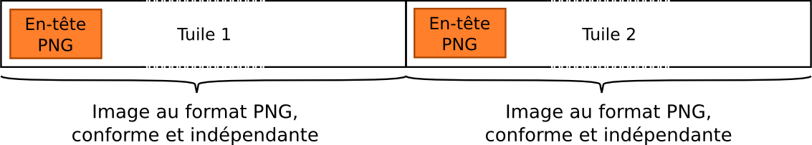
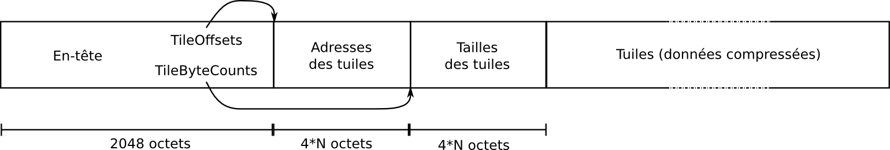

# Glossaire

| Vocabulaire | Définition |
| -- | -- |
| Fichier | Élément de stockage de la donnée dans un système de fichier. Un fichier est indentifié par son chemin complet dans une arborescence |
| Objet | Élément de stockage de la donnée dans un système de stockage objet : CEPH, S3 ou SWIFT. Un objet est identifié par son nom et le nom du conteneur (pool CEPH, bucket S3 ou container SWIFT) dans lequel il est stocké |
| SRS | Système à Référence Spatiale, système de coordonnées |
| TM | Tile Matrix, définition d'un quadrillage : une origine + une résolution + deux dimensions en pixels |
| TMS | Tile Matrix Set, ensembles de Tile Matrix, dans un même système de coordonnées |
| Pyramide | Donnée image prédécoupée et précalculée, dans une projection, à différentes résolutions (niveaux), utilisée par une couche ROK4SERVER |
| Niveau | Partie d’une pyramide, contenant des images homogènes en résolution (l'identifiant et la résolution du niveau sont définis dans le Tile Matrix Set) |
| Tuile | Unité de donnée élementaire manipulé par ROK4SERVER, image appartenant à un niveau de pyramide dont les dimensions pixels sont définis dans le Tile Matrix (la tuile est la donnée demandée lors d'un GetTile en WMTS) |
| Dalle | Un fichier ou objet constituant une pyramide de donnée, contenant une ou plusieurs tuiles contiguës d'un niveau |
| Résolution | Dimensions de l'emprise au sol (dans l'unité du SRS) d'un pixel |
| WMS | Web Map Service : [référence OGC](http://www.opengeospatial.org/standards/wms) |
| WMTS | Web Map Tiling Standard : [référence OGC](http://www.opengeospatial.org/standards/wmts) |
| TMS | Tile Map Service : [référence OSGEO](https://wiki.osgeo.org/wiki/Tile_Map_Service_Specification) |

# Le Tile Matrix Set

Un TMS est un ensemble de Tile Matrix, définissant le quadrillage d'autant de niveaux dans un fichier XML. Le SRS du TMS est indiqué avec la même convention que pour les utilitaires basés sur la librairie PROJ4, c’est-à-dire avec une chaîne de caractères formée du registre dans lequel est défini le SRS et de l’identifiant du SRS dans ce registre, par exemple : IGNF:LAMB93 ou EPSG:4326. EPSG peut être indiqué en minuscules ou en majuscule.  Toutes les informations sont définies en fonction du SRS (unité du SRS pour les coordonnées et les résolutions).
Un TM possède un identifiant (chaîne de caractères) unique dans le TMS. Les résolutions d'un niveau à l'autre ne vont pas nécessairement de deux en deux (bien que ce soit le cas le plus courant).

```xml
<tileMatrixSet>
	<crs>IGNF:LAMB93</crs>
	<tileMatrix>
		<id>17</id>
		<resolution>1</resolution> <!-- pixel size in CRS unity -->
		<topLeftCornerX> 0 </topLeftCornerX> <!-- origin in CRS unity -->
		<topLeftCornerY> 12000000 </topLeftCornerY> <!-- origin in CRS unity -->
		<tileWidth>256</tileWidth> <!-- tile size in pixel -->
		<tileHeight>256</tileHeight> <!-- tile size in pixel -->
		<matrixWidth>5040</matrixWidth> <!-- matrix size in tile -->
		<matrixHeight>42040</matrixHeight> <!-- matrix size in tile -->
	</tileMatrix>
```



Ce découpage de l'espace en tuile permet de se localiser grâce à des indices (principe du WMTS et du Tile Map Service). Ainsi, une tuile peut être identifiée avec :
* son niveau
* son indice de colonne (0 pour la première en partant de la gauche)
* son indice de ligne (0 pour la première en partant du haut)

On peut passer des coordonnées aux indices facilement. Cette conversion est utilisée pour identifier les tuiles nécessaires à la construction d'une image à partir de son emprise.

# La pyramide

Une pyramide est constituée d’un ensemble de niveaux. Chaque niveau de la pyramide correspond à un Tile Matrix, une résolution.

Une pyramide peut être de trois types :
* Les pyramides raster : pyramide contenant de la donnée image. Utilisée par ROK4SERVER, elle peut être diffusée en WMS, WMTS et TMS. ROK4SERVER sait interpréter la donnée contenue dans cette pyramide et peut la réechantillonner, la reprojeter, y appliquer un style.
* Les pyramides vecteur : pyramide contenant de la donnée vecteur. Utilisée par ROK4SERVER, elle ne peut être diffusée qu'en TMS. ROK4SERVER ne sait pas interpréter la donnée contenue dans les tuiles et ne peut alors que les retourner telles qu'elles sont stockées.
* Les pyramides raster à la demande : pyramide ne contenant pas de données mais simplement un descripteur. Utilisée par ROK4SERVER, elle ne peut être diffusée qu'en WMTS. Une pyramide à la demande va pour chaque niveau préciser la source de données que ROK4SERVER doit utiliser pour répondre aux requêtes. Vu de l'extérieur, le but est qu'un utilisateur interrogeant ROK4SERVER en WMTS ne sache pas qu'une pyramide à la demande se cache derrière.

Quand la pyramide contient des tuiles, elles sont regroupées par contiguïté en dalles, stockées en tant que fichier ou objet (Ceph, S3 ou Swift).



## Caractéristiques des données

Les caractéristiques globales d'une pyramide raster, à la demande ou non, sont :
* le nombre de canaux par pixel
* le nombre de bits par canal
* la photométrie (rgb, gray...)
* le format des canaux
* la compression des images (aucun, jpeg, lzw, packbit...)

Les caractéristiques globales d'une pyramide vecteur sont :
* le format de la donnée : Mapbox Vector Tile conditionné en PBF.

Ces caractéristiques sont valables pour l'ensemble de la pyramide.

## Les sources

Pour une pyramide raster à la demande, on va pour chaque niveau donner toutes les informations nécessaire à ROK4SERVER pour qu'il puisse constituer la réponse à la requête WMTS GetTile : soit une pyramide raster contenant vraiment de la donnée, soit un service WMS à interroger.

## Les tables

Pour une pyramide vecteur, on va préciser les tables et leurs attributs présentes dans les données, et ce par niveau. On aura également des informations sur les valeurs prises par les attributs.

## Les masques

Il est possible de stocker les masques en parallèle de la donnée dans le cas d'une pyramide raster. Les masques sont des images aux même dimensions que les images de données et permettent de distinguer précisément les pixels de données de ceux de nodata. Les masques sont des images à 1 canal sur 8 bits, compressé en deflate (zip). La valeur 0 signifie que le pixel correspondant dans l'image de données est du nodata, les valeurs de 1 à 255 signifient qu'il s'agit de donnée.

## Le descripteur de pyramide

Le descripteur de pyramide est un fichier XML (extension .pyr), au nom de la pyramide et contenant toutes les informations nécessaires à ROK4SERVER pour exploiter la pyramide (présentées au dessus). Elles sont également utilisées lorsque l'on utilise les outils ROK4GENERATION pour manipuler une pyramide : on récupère ainsi les caractéristiques de la pyramide pour utiliser les mêmes.

Selon le type de la pyramide, les informations présentes dans le descripteur sont différentes

### Informations globales

| Type de pyramide                                          | Raster, à la demande ou non                                                                                                                                                 | Vecteur        |
|-----------------------------------------------------------|-----------------------------------------------------------------------------------------------------------------------------------------------------------------------------|----------------|
| Nom du TMS associé                                        | Présent                                                                                                                                                                     | Présent        |
| Format<br>(contient la compression et le format des données) | TIFF_RAW_INT8<br>TIFF_RAW_FLOAT32<br>TIFF_LZW_INT8<br>TIFF_LZW_FLOAT32<br>TIFF_ZIP_INT8<br>TIFF_ZIP_FLOAT32<br>TIFF_PKB_INT8<br>TIFF_PKB_FLOAT32<br>TIFF_PNG_INT8<br>TIFF_JPG_INT8 | TIFF_PBF_MVT |
| Le nombre de canaux des données                           | Présent                                                                                                                                                                     | Absent         |
| La valeur du nodata                                       | Présent                                                                                                                                                                     | Absent         |
| L'interpolation utilisée à la génération                  | Présent                                                                                                                                                                     | Absent         |
| La photométrie des données                                | Présent                                                                                                                                                                     | Absent         |
Extrait d'un descripteur de pyramide raster, pour du MNT :

```xml
<tileMatrixSet>RGM04UTM38S_10cm</tileMatrixSet>
<format>TIFF_LZW_FLOAT32</format>
<channels>1</channels>
<nodataValue>-99999</nodataValue>
<interpolation>nn</interpolation>
<photometric>gray</photometric>
```

On notera que le SRS n'est pas renseigné, il l'est indirectement via le TMS.

### Informations par niveau

Les niveaux sont renseignés dans l'ordre, du plus haut (moins résolu) au plus bas (meilleure résolution). Les informations suivantes sont présentes pour les 3 types de pyramides :
* L'identifiant du Tile Matrix : code unique du niveau, identique à celui dans le TMS.
* Le nombre de tuiles, dans la hauteur et dans la largeur, dans une dalle.
* Les indices des tuiles extrêmes pour ce niveau : au-delà, on sait d'avance qu'il n'y aura pas de données

#### Pyramide raster

* Les informations sur le stockage des données et éventuellement des masques :
	* En mode "fichier" : les dossiers "racine" pour ce niveau, en relatif par rapport à l'emplacement du descripteur et la profondeur de l'arborescence (nombre de sous dossier) à partir de la racine du niveau.
	* En mode "objet" : les préfixes utilisés pour le nommage des dalles, le conteneur objet et dans le cas Swift, le type d'authentification. Les informations générale sur le cluster (URL, user...) sont stockées dans des variables d'environnement ou dans la configuration de ROK4SERVER.

Exemple de niveau d'une pyramide raster avec masques stocké dans un pool Ceph :

```xml
<level>
    <tileMatrix>4</tileMatrix>
    <tilesPerWidth>16</tilesPerWidth>
    <tilesPerHeight>16</tilesPerHeight>
    <TMSLimits>
        <minTileRow>5</minTileRow>
        <maxTileRow>5</maxTileRow>
        <minTileCol>7</minTileCol>
        <maxTileCol>8</maxTileCol>
    </TMSLimits>
    <imagePrefix>SCAN1000_IMG_4</imagePrefix>
    <cephContext>
        <poolName>PYRAMIDS</poolName>
    </cephContext>
    <mask>
        <maskPrefix>SCAN1000_MSK_4</maskPrefix>
        <format>TIFF_ZIP_INT8</format>
    </mask>
</level>
```

#### Pyramide raster à la demande

* Les informations sur le stockage des données (optionnel) : en précisant un dossier de stockage pour le niveau, on précise à ROK4SERVER qu'il doit calculer la dalle et la stocker lors de la requête d'une tuile de cette dalle. Cela permet de mémoriser le résultat pour être plus rapide à répondre aux requêtes suivantes qui concerneraient cette dalle. Ce stockage est forcément en mode fichier.
* Les sources :
    * Soit le chemin vers le descripteur de la pyramide à utiliser, un style à appliquer et une éventuelle transparence
    * Soit l'URL d'un service WMS et tous les paramètres nécessaires (version, style...)

Exemple de niveau d'une pyramide raster à la demande sans stockage avec une source WMS :

```xml
<level>
    <tileMatrix>7</tileMatrix>
    <onDemand>true</onDemand>
    <sources>
        <webService>
            <url>wxs.ign.fr/r/wms</url>
            <timeout>60</timeout>
            <retry>10</retry>
            <wms>
                <version>1.3.0</version>
                <layers>LAYER</layers>
                <styles>normal</styles>
                <crs>EPSG:2154</crs>
                <format>image/jpeg</format>
                <channels>3</channels>
                <noDataValue>255,255,255</noDataValue>
                <bbox minx="640000" miny="6840000" maxx="680000" maxy="6870000"/>
            </wms>
        </webService>
    </sources>
    <tilesPerWidth>16</tilesPerWidth>
    <tilesPerHeight>16</tilesPerHeight>
    <TMSLimits>
        <minTileRow>24</minTileRow>
        <maxTileRow>24</maxTileRow>
        <minTileCol>3</minTileCol>
        <maxTileCol>3</maxTileCol>
    </TMSLimits>
</level>
```

Exemple de niveau d'une pyramide raster à la demande avec stockage avec une pyramide source :

```xml
<level>
    <tileMatrix>7</tileMatrix>
    <onDemand>true</onDemand>
    <onFly>true</onFly>
    <baseDir>PYRAMIDE_OD/IMAGE/12</baseDir>
    <pathDepth>2</pathDepth>
    <sources>
        <basedPyramid>
            <file>/home/ign/PYRAMIDS/SCAN1000.pyr</file>
            <style>normal</style>
            <transparent>false</transparent>
        </basedPyramid>
    </sources>
    <tilesPerWidth>16</tilesPerWidth>
    <tilesPerHeight>16</tilesPerHeight>
    <TMSLimits>
        <minTileRow>24</minTileRow>
        <maxTileRow>24</maxTileRow>
        <minTileCol>3</minTileCol>
        <maxTileCol>3</maxTileCol>
    </TMSLimits>
</level>
```

#### Pyramide vecteur

* Les informations sur le stockage des données :
	* En mode "fichier" : les dossiers "racine" pour ce niveau, en relatif par rapport à l'emplacement du descripteur et la profondeur de l'arborescence (nombre de sous dossier) à partir de la racine du niveau.
	* En mode "objet" : les préfixes utilisés pour le nommage des dalles, le conteneur objet et dans le cas Swift, le type d'authentification. Les informations générale sur le cluster (URL, user...) sont stockées dans des variables d'environnement ou dans la configuration de ROK4SERVER.
* Les informations sur les tables et leurs attributs dans les données de ce niveau : on va potentiellement détailler les valeurs distinctes prises si il y en a moins de 50, et donner le minimum et le maximum pour les attributs numériques.

Exemple de niveau d'une pyramide vecteur stocké dans un dossier :

``` xml
<level>
    <tileMatrix>12</tileMatrix>
    <tilesPerWidth>16</tilesPerWidth>
    <tilesPerHeight>16</tilesPerHeight>
    <TMSLimits>
        <minTileRow>1369</minTileRow>
        <maxTileRow>1530</maxTileRow>
        <minTileCol>1989</minTileCol>
        <maxTileCol>2156</maxTileCol>
    </TMSLimits>
    <baseDir>VEK4_INDEP_LIMADMCOMPLETE/IMAGE/12</baseDir>
    <pathDepth>2</pathDepth>
    <table>
        <name>regions</name>
        <geometry>MULTIPOLYGON</geometry>
        <attribute>
            <name>nom_reg</name>
            <type>character varying</type>
            <count>18</count>
            <values>"AQUITAINE-LIMOUSIN-POITOU-CHARENTES","MARTINIQUE","GUYANE","CORSE","BOURGOGNE-FRANCHE-COMTE","GUADELOUPE","NORD-PAS-DE-CALAIS-PICARDIE","NORMANDIE","LANGUEDOC-ROUSSILLON-MIDI-PYRENEES","CENTRE-VAL DE LOIRE","MAYOTTE","ALSACE-CHAMPAGNE-ARDENNE-LORRAINE","AUVERGNE-RHONE-ALPES","ILE-DE-FRANCE","LA REUNION","PROVENCE-ALPES-COTE D'AZUR","PAYS DE LA LOIRE","BRETAGNE"</values>
        </attribute>
        <attribute>
            <name>code_reg</name>
            <type>character varying</type>
            <count>18</count>
            <values>"93","53","02","94","03","24","01","06","11","52","04","27","28","44","32","75","84","76"</values>
        </attribute>
    </table>
    <table>
        <name>departements</name>
        <geometry>MULTIPOLYGON</geometry>
        <attribute>
            <name>nom_chf</name>
            <type>character varying</type>
            <count>101</count>
        </attribute>
        <attribute>
            <name>id_geofla</name>
            <type>character varying</type>
            <count>96</count>
        </attribute>
        <attribute>
            <name>code_dept</name>
            <type>character varying</type>
            <count>97</count>
        </attribute>
        <attribute>
            <name>nom_dept</name>
            <type>character varying</type>
            <count>101</count>
        </attribute>
    </table>
</level>
```


## L'architecture de stockage

Le serveur ROK4 accède toujours aux données par tuile (via ses indices) :
* en WMTS, on ne demande qu'une tuile
* en WMS, à partir de la zone demandée, on liste les tuiles sources nécessaires à la constitution de l'image à retourner

BE4 et ROK4SERVER se mettent donc d'accord sur la façon d'agencer les données :
* Le découpage en tuile est défini par le TMS (comme vu plus haut)
* Le regroupement en dalle est défini dans le descripteur de pyramide : des indices de la tuile, par division euclidienne, on obtient les indices de la dalle, en partant du coin supérieur gauche définit dans le TMS.
* Reste l'emplacement de stockage de la dalle, que nous allons décrire maintenant
* Et quelle partie de la dalle correspond à notre tuile, ce que nous verrons après dans la partie "La structure d'une dalle"

On note les indices avec la colonne en premier : (_colonne_, _ligne_)

### En mode fichier

Toutes les images, que ce soit les données ou les masques, sont dans un dossier portant le même nom que le descripteur. Elles sont cependant séparées dans des sous arborescences parallèles.



Repartons des indices de la tuile voulue (414, 3134) avec des dalles de 16 tuiles par 16 tuiles : on veut donc accéder à la dalle (25,195). Ces indices sont ensuite convertis en base 36 (avec les chiffres dans cet ordre : 0123456789ABCDEFGHIJKLMNOPQRSTUVWXYZ) : (24,195) donne ('P', '5F')

On peut être amené à ajouter des 0 pour forcer la longueur de l'écriture en base 36, pour s'adapter à la profondeur d'arborescence voulue ou avoir la même longueur pour les 2 indices. Avec une profondeur d'arborescence de 2, les indices vont être découpés en 3 parties (les deux niveaux de dossier + le nom du fichier). On a donc besoin d'avoir des indices en base 36 sur au moins 3 chiffre : ('00P', '05F'). On obtient le chemin suivant, en relatif à partir de la racine du niveau (que ce soit la donnée ou le masque) : `00/05/PF.tif`. Soit un chemin complet :
* pour la dalle de donnée : `PYRAMID-NAME/IMAGE/level-19/00/05/PF.tif`
* pour la dalle de masque : `PYRAMID-NAME/MASK/level-19/00/05/PF.tif`

Dans un cas où l'écriture en base 36 nécessite plus de chiffres qu'il n'y a de parties dans le chemin, c'est le premier dossier qui contiendra plus de chiffres : ('C4C3C2C1C0','L4L3L2L1L0') donnera C4C3C2L4L3L2/C1L1/C0L0.tif.

Avec cette manière de ranger les données, un dossier de l'arborescence contiendra des dalles contiguës.

### En mode objet

En mode objet, le nommage est beaucoup plus simple car on utilise directement les indices de dalle en base 10. Si on reprend la dalle précédente (24,195), on aura les objets suivants :
* pour la dalle de donnée : `PYRAMID-NAME_IMG_level-19_24_195`
* pour la dalle de masque : `PYRAMID-NAME_MSK_level-19_24_195`

## La structure d'une dalle

Les images sont au format TIFF ([Tagged Image File Format](http://partners.adobe.com/public/developer/en/tiff/TIFF6.pdf)). Ce dernier offre de nombreuse possibilité de stockage des données. Le concept principal est de renseigner les différentes informations via des « tags », des champs ([liste des tags](http://www.awaresystems.be/imaging/tiff/tifftags/search.html)).  On peut ainsi préciser les nombres de canaux, leur format et taille, la photométrie, la structure des données, toute sorte de métadonnées, rendant possible l'interprétation de l'image par les programmes. Ce document n'a par pour but de reprendre les spécifications du format TIFF, mais de voir globalement les possibilités et préciser celles exploitées.

### L'en-tête

On retrouve dans cette partie toutes les informations sur le fichier que les logiciels vont utiliser pour afficher l'image.



Par exemple, l'étiquette _imageWidth_ (256), de type _Long_ (4), une seule valeur sur 32 bits, elle tient donc sans passer par une adresse : 4096. Ce qui donne en héxadécimal, little endian : `00 01   04 00   01 00 00 00   00 10 00 00`

Cependant, ROK4 a déjà connaissance de ces métadonnées car stockées dans le descripteur de pyramide et le TMS. On peut donc gagner du temps en ignorant cet en-tête. C'est pourquoi celle-ci fait toujours 2048 octets, dont la majorité n'est pas exploitée.

On va enfin trouver dans cet en-tête les informations sur le tuilage, ou plutôt sur l'endroit où ces informations sont stockées (adresses et tailles).

### Les données

#### Le tuilage

Le format TIFF permet de stocker les images par bloc, ceci dans le but d’accéder efficacement à toutes les parties de l’image. On peut ainsi accéder à chaque tuile contenue dans l'image (dalle) facilement. On conserve bien dans la structure de l'image le découpage en tuile. Chaque tuile est indépendante des autres, formant une image à part entière, moins l'en-tête. Elles sont enregistrées de gauche à droite puis de haut en bas.

Pour ce faire, on renseigne l'adresse de début (_TileOffsets_) sur 4 octets et la taille en octet (_TileByteCounts_) sur 4 octets de chaque tuile. Ces valeurs sont stockées à partir de 2048 octets, ce sont les premières valeurs lues par le serveur ROK4.



L'en-tête contient les étiquettes :
* TileOffsets : tag 324, type Long, on aura N valeurs, et celles-ci ne tenant pas toutes sur 4 octets, on donne l'adresse à laquelle ces valeurs commencent (ici 2048)
* TileByteCounts : tag 325, type Long, on aura N valeurs, et celles-ci ne tenant pas toutes sur 4 octets, on donne l'adresse à laquelle ces valeurs commencent (ici 2048 + 4*N)

De cette manière, que ce soit ROK4 en étêtant de 2048 octets, ou les autres programmes, le tuilage est compris.

#### La compression

Le format TIFF permet de nombreuse compression des données. Cette compression est effectuée sur chaque tuile. ROK4 va comprendre l'absence de compression et les compressions :
* sans pertes : LZW, PNG, PackBits, Deflate
* avec pertes : JPEG

Le PNG a une particularité : la compression correspond à du Deflate, mais on veut que ROK4 puisse retourner facilement des tuiles de PNG, avec l'en-tête. Dans ce cas, les dalles ne sont pas lisible par d'autres applications que ROK4.



#### Récapitulatif

Voici la structure globale d'une image de la pyramide ROK4, dalle contenant N tuiles.



### Les références

Lors de la création d'une pyramide de mise à jour, on ne va potentiellement pas recopier toutes les données de la version précédente, mais simplement les référencer à l'aide de liens symbolique en stockage fichier ou d'objets symboliques (objet contenant simplement le nom de l'objet cible) en stockage objet. Cela est mis en place par les outils BE4 mais est complètement transparent pour ROK4SERVER qui se contente de lire UNE pyramide.

## Le fichier liste

Le fichier liste est un fichier texte (extension .list) au nom de la pyramide et situé à côté du descripteur de pyramide. Il contient la liste de toutes les dalles de données et masques que contient la pyramide. Si certaines dalles ne sont que des références dans la pyramide (liens/objets symboliques), c'est le nom du fichier/objet cible qui est listé (appartenant à la structure d'une autre pyramide).

Ce fichier est uniquement utilisé par les outils BE4, pour connaître sans avoir à parcourir la pyramide son contenu exact (indispensable lors d'une mise à jour).

Le fichier liste est en deux parties, séparées par un dièse :
* L'en-tête permet de lister et d'indexer les pyramides référencées, c'est-à-dire contenant au moins une des dalles listées. L'index 0 sera pour la pyramide elle même. Ces index sont utiliser dans la liste des dalles pour "factoriser" les racines des pyramides (conteneur dans le cas objet, dossier racine de la pyramide dans le cas fichier).
* La liste des dalles (données et masques)

Exemple de liste pour un stockage fichier

```
0=/home/ign/PYRAMIDS/PYRAMID_V2
1=/home/ign/PYRAMIDS/PYRAMID_V1
#
1/IMAGE/19/04/RR/R2.tif
1/IMAGE/19/04/RR/R3.tif
1/IMAGE/19/04/RR/S1.tif
1/IMAGE/19/04/RR/T1.tif
1/IMAGE/19/04/RR/U0.tif
1/IMAGE/19/04/RR/U1.tif
1/IMAGE/19/04/RR/S2.tif
1/IMAGE/19/04/RR/T2.tif
1/IMAGE/19/04/RR/S3.tif
1/IMAGE/19/04/RR/T3.tif
1/IMAGE/19/04/RR/U2.tif
1/IMAGE/18/02/DD/VJ.tif
1/IMAGE/17/01/66/XR.tif
1/IMAGE/16/00/3L/GD.tif
1/IMAGE/18/02/DD/WI.tif
1/IMAGE/18/02/DD/XI.tif
0/IMAGE/19/04/VZ/JV.tif
0/IMAGE/19/04/VZ/FY.tif
0/IMAGE/19/04/VZ/FZ.tif
0/IMAGE/19/04/VZ/GX.tif
0/IMAGE/19/04/VZ/HX.tif
0/IMAGE/19/04/VZ/IW.tif
0/IMAGE/19/04/VZ/JW.tif
0/IMAGE/19/04/VZ/IX.tif
0/IMAGE/19/04/VZ/JX.tif
0/IMAGE/19/04/VZ/GY.tif
0/IMAGE/19/04/VZ/HY.tif
0/IMAGE/19/04/VZ/GZ.tif
0/IMAGE/19/04/VZ/HZ.tif
0/IMAGE/19/04/VZ/IY.tif
0/IMAGE/19/04/VZ/JY.tif
0/IMAGE/19/04/VZ/IZ.tif
0/IMAGE/19/04/VZ/JZ.tif
```

Exemple de liste pour un stockage objet

```
0=PYRAMIDS
#
0/PYRAMID_V2_IMG_11_65_42
0/PYRAMID_V2_MSK_11_65_42
0/PYRAMID_V2_IMG_11_65_43
0/PYRAMID_V2_MSK_11_65_43
0/PYRAMID_V2_IMG_11_66_42
0/PYRAMID_V2_MSK_11_66_42
0/PYRAMID_V2_IMG_11_67_42
0/PYRAMID_V2_MSK_11_67_42
0/PYRAMID_V2_IMG_11_66_43
0/PYRAMID_V2_MSK_11_66_43
0/PYRAMID_V2_IMG_11_67_43
0/PYRAMID_V2_MSK_11_67_43
0/PYRAMID_V2_IMG_11_65_44
0/PYRAMID_V2_MSK_11_65_44
0/PYRAMID_V1_IMG_11_61_42
0/PYRAMID_V1_MSK_11_61_42
0/PYRAMID_V1_IMG_11_61_43
0/PYRAMID_V1_MSK_11_61_43
0/PYRAMID_V1_IMG_11_62_42
0/PYRAMID_V1_MSK_11_62_42
0/PYRAMID_V1_IMG_11_63_42
0/PYRAMID_V1_MSK_11_63_42
0/PYRAMID_V1_IMG_11_62_43
0/PYRAMID_V1_MSK_11_62_43
```
