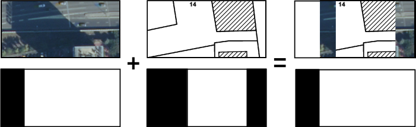
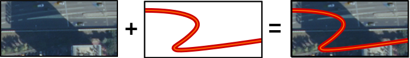
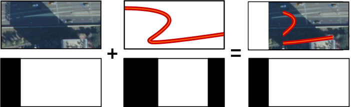
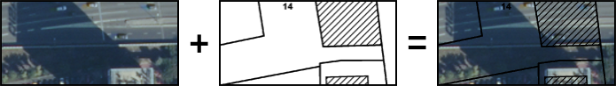
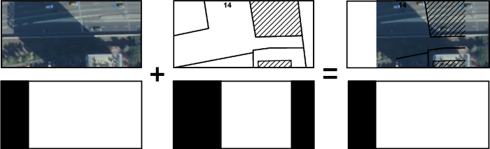

# JOINCACHE

[Vue générale](../../README.md#la-suite-joincache)

## Usage

### Commandes

* `joinCache-file --conf /home/IGN/conf.txt [--help|--usage|--version]`
* `joinCache-ceph --conf /home/IGN/conf.txt [--help|--usage|--version]`

### Options

* `--help` Affiche le lien vers la documentation utilisateur de l'outil et quitte
* `--usage` Affiche le lien vers la documentation utilisateur de l'outil et quitte
* `--version` Affiche la version de l'outil et quitte
* `--conf <file path>` Execute l'outil en prenant en compte ce fichier de configuration principal

## La configuration principale

La configuration principale est au format INI :
```
[ section ]
parameter = value
```

### Section `logger`

#### Paramètres

| Paramètre | Description | Obligatoire ou valeur par défaut |
| --------- | ----------- | -------------------------------- |
| log_path  | Dossier dans lequel écrire les logs. Les logs ne sont pas écrits dans un fichier si ce paramètre n'est pas fourni.                                                                                   |                                  |
| log_file  | Fichier dans lequel écrire les logs, en plus de la sortie standard. Les logs ne sont pas écrits dans un fichier si ce paramètre n'est pas fourni. Le fichier écrit sera donc `<log_path>/<log_file>` |                                  |
| log_level | Niveau de log : DEBUG - INFO - WARN - ERROR - ALWAYS                                                                                                                                                 | `WARN`                             |


#### Exemple
```
[ logger ]
log_path = /var/log
log_file = joinCache_2019-02-01.txt
log_level = INFO
```

### Section `pyramid`

#### Paramètres

| Paramètre         | Description                                                                                                                                | Obligatoire ou valeur par défaut |
| ----------------- | ------------------------------------------------------------------------------------------------------------------------------------------ | -------------------------------- |
| pyr_name_new      | Nom de la nouvelle pyramide                                                                                                                | obligatoire                      |
| pyr_desc_path     | Dossier dans le quel écrire le descripteur de pyramide et la liste des dalles                                                              | obligatoire                      |
| image_width       | Nombre de tuiles dans une dalle dans le sens de la largeur                                                                                 | `16`                             |
| image_height      | Nombre de tuiles dans une dalle dans le sens de la hauteur                                                                                 | `16`                             |
| tms_name          | Nom du Tile Matrix Set de la pyramide, avec l'extension `.tms`                                                                             | obligatoire si pas d'ancêtre     |
| tms_path          | Dossier contenant le TMS                                                                                                                   | obligatoire                      |
| pyr_level_top     | Niveau du haut de la pyramide, niveau haut du TMS utilisé si non fourni                                                                    |                                  |
| compression       | Compression des données dans les tuiles                                                                                                    | `raw`                            |
| compressionoption | Option complémentaire à la compression                                                                                                     | `none`                           |
| color             | Valeur de nodata, une valeur par canal, cohérent avec son format                                                                           |                                  |
| bitspersample     | Nombre de bits par canal, `8` ou `32`                                                                                                      |                                  |
| sampleformat      | Format des canaux, `uint` ou `float`                                                                                                       |                                  |
| samplesperpixel   | Nombre de canaux : entre 1 et 4                                                                                                            |                                  |
| photometric       | Interprétation des canaux : `gray` ou `rgb`                                                                                                | `rgb`                            |
| interpolation     | Interpolation de réechantillonnage utilisée par mergeNtiff : `nn`, `linear`, `bicubic`, `lanczos`                                          | `bicubic`                        |
| export_masks      | Précise si on souhaite écrire les masques dans la pyramide, force l'utilisation des masques pendant la génération si l'export est souhaité | `FALSE`                          |

La pyramide en sortie aura ces caractéristiques et les pyramides sources devront en avoir en commun (voir section `composition`).

##### Stockage de la pyramide

| Type de stockage | Paramètre               | Description                                                                 | Obligatoire ou valeur par défaut |
|------------------|-------------------------|-----------------------------------------------------------------------------|----------------------------------|
| FILE             | pyr_data_path           | Dossier racine de stockage des données de la pyramide                       | obligatoire                      |
| FILE             | dir_depth               | Nombre de sous-dossiers utilisé dans l'arborescence pour stocker les dalles | `2` si pas d'ancêtre             |
| CEPH             | pyr_data_pool_name      |                                                                             | obligatoire                      |

Dans le cas du stockage objet, certaines variables d'environnement doivent être définies sur les machines d'exécution :
* CEPH
    - ROK4_CEPH_CONFFILE
    - ROK4_CEPH_USERNAME
    - ROK4_CEPH_CLUSTERNAME

#### Exemple

```
[ pyramid ]

pyr_data_path = /home/IGN/PYRAMIDS
pyr_desc_path = /home/IGN/DESCRIPTOR
pyr_name_new = MERGE
pyr_level_top = 6

tms_name = PM.tms
tms_path = /home/IGN/TMS

dir_depth = 2
image_width = 16
image_height = 16
```

### Section `process`

#### Paramètres

| Paramètre        | Description                                                                                             | Obligatoire ou valeur par défaut                                 |
| ---------------- | ------------------------------------------------------------------------------------------------------- | ---------------------------------------------------------------- |
| job_number       | Niveau de parallélisation de la génération de la pyramide.                                              | obligatoire                                                      |
| path_temp        | Dossier temporaire propre à chaque script. Un sous dossier au nom de la pyramide et du script sera créé | obligatoire                                                      |
| path_temp_common | Dossier temporaire commun à tous les scripts. Un sous dossier COMMON sera créé                          | obligatoire                                                      |
| path_shell       | Dossier où écrire les scripts                                                                           | obligatoire                                                      |
| use_masks        | Précise si on souhaite utilisé les masques associés aux données.                                        | `FALSE` si on ne souhaite pas exporter les masques, `TRUE` sinon |
| merge_method     | Précise comment procéder lorsqu'une même dalle est trouvée dans plusieurs pyramides sources             | obligatoire                                                      |

Valeurs pour `merge_method` :
* `replace` : seule la dalle dans la pyramide source la plus prioritaire est retenue, ce qui permet éventuellement de faire un lien symbolique
* `top` : on calcule la dalle résultante en ne conservant que le pixel de donnée de la dalle la plus prioritaire. N'est intéressant par rapport à TOP que si les dalles sources sont accompagnées de masques de données.

* `alphatop` : on calcule la dalle résultante en fusionnant les pixels des dalles source (dans l'ordre de priorité) en tenant compte de la transparence (un pixel complètement opaque masque les pixels d'en dessous). On tient compte des masques de données éventuellement présents.
    - Sans masque

    - Avec masques

* `multiply` : on calcule la dalle résultante en fusionnant les pixels des dalles source par multiplication canal par canal. On tient compte des masques de données éventuellement présents.
    - Sans masque

    - Avec masques


#### Exemple
```
[ process ]
path_temp = /tmp
path_temp_common = /mnt/share/
path_shell  = /home/IGN/SCRIPT/
job_number = 4
merge_method = alphatop
use_masks = TRUE
```

### Section `extents`

Cette section permet de définir les zones d'utilisation des pyramides source. La clé du paramètre sera l'identifiant unique de cette zone et la valeur sera :
* Soit un rectangle englobant, dans la projection des pyramides (sources et en sortie)
* Soit le chemin vers un fichier contenant une géométrie en WKT, GeoJSON ou GML.

#### Exemple

```
[ extents ]

PARIS = 640000,6858000,658000,6867000
FXX = /home/IGN/fxx.wkt
```


### Section `composition`

On liste par niveau et étendue la ou les pyramides à utiliser, en définissant implicitement l'ordre de priorité. Les paramètres sont fournis sous la forme `<niveau>.<zone> = <chemin vers le descripteur de la pyramide 1>[,<chemin vers le descripteur de la pyramide 2>]` :
* `<niveau>` est l'identifiant (défini dans le TMS) du niveau pour lequel utiliser cette ou ces pyramides
* `<zone>` est l'identifiant de la zone (défini dans la section `extents`) sur laquelle utiliser cette ou ces pyramides
* La liste des chemins vers les descripteurs des pyramides à utiliser définit la priorité : la pyramide citée en première sera prioritaire, ses dalles seront "au dessus" dans les fusions éventuelles de dalles.

Il est aussi possible de définir sur plusieurs lignes :
```
16.FXX = /chemin/vers/pyramide_1.pyr,/chemin/vers/pyramide_2.pyr
```
équivaut à
```
16.FXX = /chemin/vers/pyramide_1.pyr
16.FXX = /chemin/vers/pyramide_2.pyr
```

Les pyramides sources doivent :
* utiliser le même TMS que la pyramide de sortie (donc toutes les pyramides manipulées dans cette outil respecte le même TMS)
* utiliser le même nombre de tuiles par dalle que la pyramide de sortie
* avoir le même format de canal que la pyramide de sortie (entier sur 8 bits non signé ou flottant sur 32 bits)

#### Exemple

```
[ composition ]

16.FXX = /chemin/vers/pyramide_1.pyr,/chemin/vers/pyramide_2.pyr
17.FXX = /chemin/vers/pyramide_1.pyr
17.PARIS = /chemin/vers/pyramide_3.pyr
```

## Résumé des fichiers et dossiers manipulés

Avec les configurations mises en exemple :
* La configuration principale `/home/IGN/conf.txt`
* Le TMS `/home/IGN/TMS/PM.tms`
* Le fichier de logs `/var/log/joinCache_2019-02-01.txt`
* Le descripteur de pyramide de sortie `/home/IGN/DESCRIPTOR/MERGE.pyr`
* La liste des dalles `/home/IGN/DESCRIPTOR/MERGE.list`.
* Les descripteurs des pyramides sources `/chemin/vers/pyramide_1.pyr`, `/chemin/vers/pyramide_2.pyr` et `/chemin/vers/pyramide_3.pyr` et les fichiers listes associés `/chemin/vers/pyramide_1.list`, `/chemin/vers/pyramide_2.list` et `/chemin/vers/pyramide_3.list`
* Les scripts : `/home/IGN/SCRIPT/SCRIPT_1.sh`, `/home/IGN/SCRIPT/SCRIPT_2.sh`, `/home/IGN/SCRIPT/SCRIPT_3.sh`, `/home/IGN/SCRIPT/SCRIPT_4.sh`, exécutables en parallèle et sur des machines différentes.
* Le dossier temporaire commun `/mnt/share/COMMON/`
* Les dossiers temporaires propres à chaque script `/tmp/MERGE/SCRIPT_1/`, `/tmp/MERGE/SCRIPT_2/`, `/tmp/MERGE/SCRIPT_3/`, `/tmp/MERGE/SCRIPT_4/`
* Dans le cas d'un stockage fichier : le dossier contenant les données de la pyramide `/home/IGN/PYRAMIDS/MERGE/`
